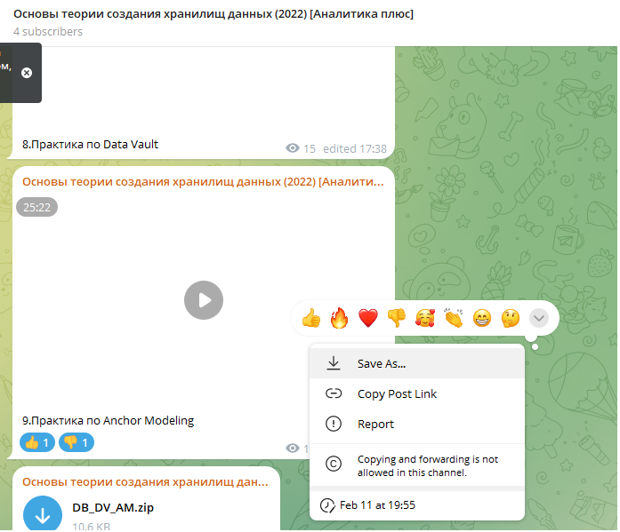

# Telegram Desktop - mod AndranikFutureLabs

Данная модификация Telegram Desktop (@AndranikFutureLabs) направлена на снятие ограничений, накладываемых владельцами каналов и групп на контент. Основная цель — обеспечить пользователю полный контроль над данными, включая возможность сохранения медиафайлов и пересылки сообщений из защищенных чатов.

## Документация V2
- [Описание изменений и функционала](telegramdestop_mod_AndranikFutureLabs_V2.md)
- [Проблемы сборки и их решения](telegramdestop_mod_AndranikFutureLabs_AssemblyProblemsAndSolutions_V2.md)

## Структура репозитория
- `bin/`: Исполняемый файл модификации.
- `src_changes/`: Исходный код измененных файлов.
